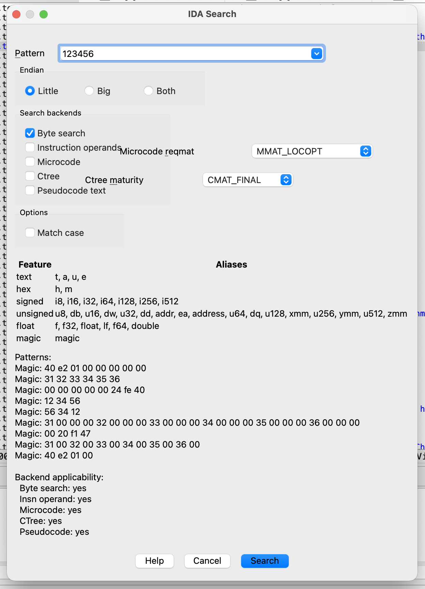

# IDA Search

An IDA Pro 9.x plugin that brings [010 Editor](https://www.sweetscape.com/010editor/manual/Find.htm)-style type-aware binary search to IDA, with five search backends ranging from raw byte matching to decompiled pseudocode search.

## Installation

Place this directory under your IDA plugins folder (for example `~/.idapro/plugins/ida-search/`). The `ida-plugin.json` manifest tells IDA to load `plugin.py` on startup.

Alternatively, install via [HCLI](https://hcli.docs.hex-rays.com/):

```
hcli plugin install ida-search
```

## Quick Start

1. Press **Alt-B** for quick byte search, or **Alt-Shift-B** to open the advanced search form.  Both default to **case-insensitive** matching.
2. Type a value followed by a comma and a type specifier:

| Input | What it searches for |
|---|---|
| `453f,h` | Hex bytes `0x45 0x3F` |
| `0x100,i32` | Signed 32-bit integer `256` |
| `2.5,lf` | Double-precision float `2.5` |
| `hello,t` | Text string `"hello"` in all IDB encodings |
| `915..919,range` | Any constant in [915, 919] via microcode/ctree |
| `hello` | All types (auto-detect) |

3. Results appear in a chooser window.  Double-click to jump to an address.
4. Use **Ctrl-B** / **Ctrl-Shift-B** to navigate to next/previous match.

## Advanced Search Form

Press **Alt-Shift-B** to open the unified search form.  It provides:

- **Pattern input** with live preview of generated byte patterns.
- **Type selector** dropdown to force a specific type specifier.
- **Match case** checkbox (unchecked by default).  When unchecked, text searches are case-insensitive.  Check it for exact-case matching.
- **Endian selector** (Little / Big / Both) -- shown automatically when relevant.
- **Backend checkboxes** to select which search strategies to run:

| Checkbox | Backend | What it searches |
|---|---|---|
| Byte search | `ByteSearchBackend` | Raw bytes via `bin_search` (always available) |
| Instruction operands | `InsnOperandBackend` | `decode_insn` at every offset (always available) |
| Microcode | `MicrocodeBackend` | Hex-Rays microcode operands (globals, immediates, call targets, helpers, strings, float constants; requires decompiler) |
| CTree | `CTreeBackend` | Decompiled AST nodes and switch case values (requires decompiler) |
| Pseudocode text | `PseudocodeTextBackend` | Substring in decompiled output (requires decompiler) |

The form shows which backends are applicable for the current input.  Hex-Rays backends are hidden when the decompiler is not available.

Multiple backends can be checked at once -- each produces its own results window.

## Input Syntax

Format: `value,type` -- the last comma separates the value from the type specifier.  If no comma is present, the **Magic** auto-detect mode tries all types.

### Text Types

| Alias | Name | Description |
|---|---|---|
| `t` | Text | Searches using all IDB encodings |
| `a` | ASCII String | ASCII + Latin-1 |
| `u` | Unicode String | UTF-8, UTF-16, UTF-32 (endian-aware) |
| `e` | EBCDIC String | EBCDIC (cp500) |

Text searches are **case-insensitive by default**.  To match exact case, check **Match case** in the advanced form (Alt-Shift-B).

### Hex / Masked Bytes

| Alias | Name | Description |
|---|---|---|
| `h` | Hex Bytes | Hex bytes, can be entered without spaces.  Use `??` for wildcards. |
| `m` | Masked Bytes | Per-bit masks using `?`.  Every byte must be space-separated. |

**Hex Bytes examples:**

```
45 3f,h             -> bytes 0x45, 0x3F
0x41 0x42 0x43,h    -> bytes with 0x prefix
45 ?? 3f,h          -> 0x45, <any>, 0x3F
{41; 42; 43},h      -> C-style array syntax
```

**Masked Bytes examples:**

```
0b1?00001,m         -> matches 'A' (0x41) or 'a' (0x61)
0x41/0x20,m         -> same, using explicit byte/mask pair
0o1?1,m             -> octal with masked digit
```

### Integer Types

| Alias | Name | Width |
|---|---|---|
| `i8` | Signed Byte | 1 |
| `u8`, `db` | Unsigned Byte | 1 |
| `i16` | Signed Short | 2 |
| `u16`, `dw` | Unsigned Short | 2 |
| `i32` | Signed Int | 4 |
| `u32`, `dd` | Unsigned Int | 4 |
| `i64` | Signed Quad | 8 |
| `u64`, `dq` | Unsigned Quad | 8 |
| `i128` | Signed Octa | 16 |
| `u128`, `xmm` | Unsigned Octa | 16 |
| `i256` | Signed ymm | 32 |
| `u256`, `ymm` | Unsigned ymm | 32 |
| `i512` | Signed zmm | 64 |
| `u512`, `zmm` | Unsigned zmm | 64 |

Integer values accept decimal, `0x` hex, `0o` octal, and `0b` binary prefixes.

### Range

| Alias | Name | Description |
|---|---|---|
| `range`, `r` | Range | Searches for any integer in [low..high] (inclusive) |

Range searches find numeric constants whose value falls within the given bounds.  Both bounds are inclusive.  Values accept decimal, `0x` hex, `0o` octal, and `0b` binary prefixes.

**Examples:**

```
915..919,range              -> any constant in [915, 919]
915..919,r                  -> same (short alias)
0x1018FD20..0x1018FD54,range -> address range
915..919                    -> Magic auto-detects the .. syntax
```

Range is only applicable to semantic backends (Instruction Operand, Microcode, CTree).  Byte search and pseudocode text search are not applicable since they cannot match value ranges.

### Float Types

| Alias | Name | Width |
|---|---|---|
| `f`, `f32`, `float` | Float | 4 |
| `lf`, `f64`, `double` | Double | 8 |

### Magic (Auto-Detect)

When no type specifier is given (no trailing `,alias`), the plugin tries all types with rank < 5 and unions the results.

`rank` is the parser priority used by auto-detect mode. Lower-rank types are considered first, and higher-rank types can be excluded from Magic mode entirely.

## Search Backends

The plugin supports five search backends, each trading speed for semantic accuracy:

| # | Backend | Speed | Requires | What it searches |
|---|---|---|---|---|
| 1 | **Byte Search** | Fastest | Nothing | Raw bytes via `bin_search` |
| 2 | **Instruction Operand** | Fast | Nothing | `decode_insn` at every offset, checks `op_t.value`/`op_t.addr` |
| 3 | **Microcode** | Slow | Hex-Rays | Microcode operands via `mba.for_all_ops` (constants, strings, helper names) |
| 4 | **CTree** | Slow | Hex-Rays | Decompiled AST (`cfunc_t.body`) -- numeric/string/float literals, object references, and switch case values |
| 5 | **Pseudocode Text** | Slow | Hex-Rays | Substring match in decompiled pseudocode output |

### Which terms work with which backends?

| Backend | Numbers | Text | Bytes | Floats | Ranges |
|---|---|---|---|---|---|
| Byte Search | yes | yes | yes | yes | -- |
| Instruction Operand | yes | -- | -- | -- | yes |
| Microcode | yes | yes | -- | yes | yes |
| CTree | yes | yes | -- | yes | yes |
| Pseudocode Text | yes | yes | -- | yes | -- |

### When to use which backend

- **Byte Search** (default): fastest, finds raw byte patterns anywhere in the binary.  Use for known byte sequences, strings, or constants whose encoding you understand.
- **Instruction Operand**: finds constants used as instruction immediates or memory references, regardless of how the bytes are laid out.  Good for finding all references to a specific address or constant.
- **Microcode**: searches Hex-Rays intermediate representation.  Catches constants after compiler optimizations (constant folding, strength reduction) that byte search would miss.
- **CTree**: searches the decompiled AST.  Distinguishes between numeric constants, string literals, floating-point literals, object references, and switch case values.
- **Pseudocode Text**: plain substring search in the decompiler output.  Finds variable names, type names, comments, enum members -- anything visible in the pseudocode window.

## Endianness

For integer and Unicode types, the plugin respects the endianness of the current processor module (`idaapi.inf_is_be()`).  The advanced search form also allows choosing Little / Big / Both explicitly.

## Case Sensitivity

All searches default to **case-insensitive** matching.  The advanced search form (Alt-Shift-B) has a **Match case** checkbox (unchecked by default) to opt into exact-case matching.

How each backend handles case insensitivity:

| Backend | Strategy |
|---|---|
| **Byte Search** | Per-bit masking -- ASCII alpha bytes get mask `0xDF` (bit 5 = don't care), so `A` and `a` both match.  For EBCDIC (cp500), both upper and lower variants are generated. |
| **Instruction Operand** | Numbers only -- not affected. |
| **Microcode** | Lower-fold comparison on `mop_t.cstr` strings. |
| **CTree** | Lower-fold comparison on `cot_str` and `cot_obj` names. |
| **Pseudocode Text** | Lower-fold substring matching. |

## Keyboard Shortcuts

| Shortcut | Action |
|---|---|
| **Alt-B** | Quick byte search (case-insensitive by default) |
| **Alt-Shift-B** | Advanced search (form with backend checkboxes and Match case option) |
| **Ctrl-B** | Find next occurrence |
| **Ctrl-Shift-B** | Find previous occurrence |

## Selection Behavior

- **Small selection** (up to 64 bytes): the selected bytes are converted to a hex query (`xx xx xx,h`).
- **Large selection**: the search range is limited to the selected region.

Selection behavior applies to the quick byte search (Alt-B).

## Architecture

The plugin uses a three-stage compiler pipeline:

```
Frontend (text -> IR)  ->  IR (semantic terms)  ->  Backend (searchable queries)
```

### Modules

| Module | Role |
|---|---|
| `ir.py` | Intermediate representation: `NumberTerm`, `TextTerm`, `BytesTerm`, `FloatTerm`, `RangeTerm` |
| `frontend.py` | Parsers that convert user input strings into IR nodes (`TypeSpec` subclasses) |
| `backend.py` | Five backends that convert IR nodes into search queries + IDA search execution |
| `parse.py` | Orchestration layer (`PatternLocator`) and public API re-exports |
| `plugin.py` | IDA plugin integration: actions, choosers, keybindings |
| `ask_form.py` | IDA Form UI with live preview and backend checkboxes |

### Adding a new input type

1. Subclass `TypeSpec` in `frontend.py`.
2. Set `name`, `aliases`, `description`, `category`, `rank`.
3. Implement `parse(value: str) -> list[SearchTerm]`.
4. The new class is auto-registered via `TypeSpec.__init_subclass__`.

### Adding a new search backend

1. Define a frozen dataclass for the query (e.g. `MyQuery`).
2. Create a backend class with `emit(term: SearchTerm) -> MyQuery | None`.
3. Add a `search_my_thing(query)` execution function (IDA-dependent).
4. Add a `to_my_query()` method on `PatternLocator` in `parse.py`.

## License

MIT
